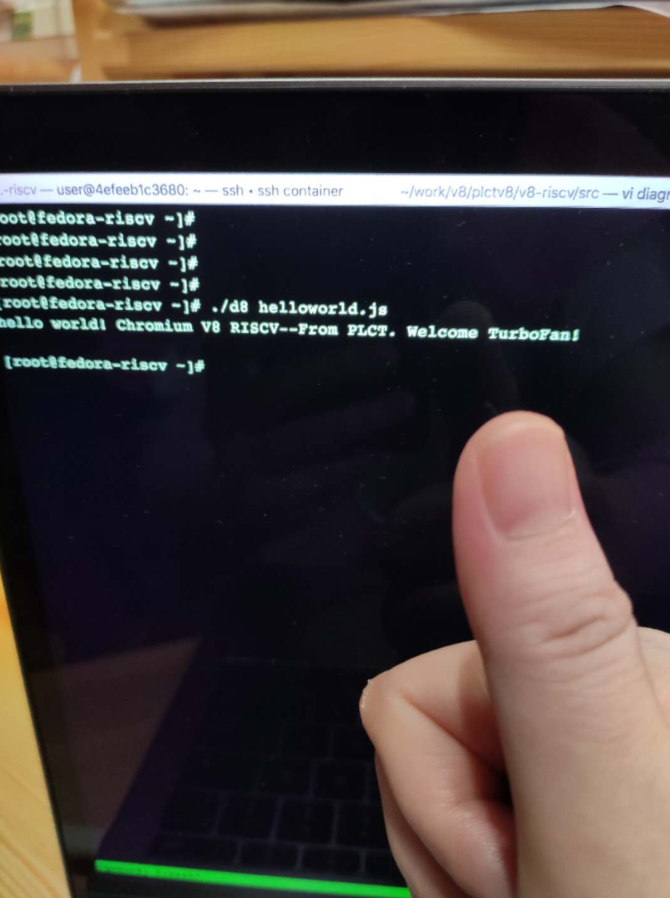

V8 for RISC-V (WIP)
====================

目前项目还在开发中。欢迎提供意见和帮助！

This is an ongoing project. Comments are welcome!

当前状态：目前d8已经可以跑一个helloworld，可以用QEMU搭配Fedora的RV64 port 尝试下。

Current Status: Now d8 can run `helloworld.js` on QEMU Emulator, using Fedora Developer RV64 image.

How to build it
---------------------

中国大陆的朋友：你很有可能跟我们一样，面临的最大问题是网络环境太糟糕了。
推荐花点钱，在AWS或者其他便宜的云服务商，在美国或者其他国家购买一个虚拟机，磁盘空间大，做V8的实验。

If you are in mainland China, you might have troubles with the network connections.
We recommand you to buy a VPS oversea, with a large HDD. Your life would be happier after you have your own VPS.


0x00 构建起来V8的X64构建环境：

1. 获取 depot_tools 和 v8 源代码。这一步可以参考V8官方的构建方法，也可以直接使用  https://github.com/isrc-cas/PLCT-Toolbox/blob/master/get_v8_env.sh 。如果fetch/clone有困难，可以从 https://mirror.iscas.ac.cn/plct/v8.snapshot-20200531.tbz 到本地之后解压缩
2. 配置 PATH 路径，将 `depot_tools` 加入，并放在 PATH 路径的前面。注意这对于后续的 `clang-format` 等工具有影响。
3. 注意步骤1中的压缩文件是克隆和构建v8之后的快照，基本是全的；但是v8构建的时候会在用户的 HOME 下建立两个隐藏文件夹，不在上述快照的压缩里，所以，构建的时候依然需要有海外基础设施。
4. 进入到 v8 目录，运行 `./build/install-build-deps.sh --no-chromeos-fonts` 确保必要的内容都安装了。
5. `tools/dev/gm.py x64.release` 验证下是否能够成功构建。如果等了很久然后报错误的话，挂上海外节点，把缺失的 vpython 环境补上。
6. 至此，基础环境OK了，接下来基本不再需要海外设施。如果上述步骤出错，那么在步骤5之前再加一个 `gclient sync` 运行下。接下来就是 RISC-V 范围啦。

0x01 构建 RISC-V V8:

7. 准备 build 配置。 `cd build/ && git remote add isrc https://github.com/isrc-cas/chromium-v8-build && git fetch isrc && git checkout plct-dev`
8. 添加PLCT的V8代码。`cd ../ && git remote add isrc https://github.com/isrc-cas/v8-riscv && git fetch isrc && git checkout plct-riscv64`
9. 准备好RV64工具链 Get your RISCV64 toolchain ready。可以参考 https://github.com/isrc-cas/PLCT-Toolbox/blob/master/build_riscv_toolchain.sh 直接运行OK，注意，PATH和RISCV的环境变量的添加需要手工来。
10. 测试下X64下的构建。`tools/dev/gm.py riscv64.release` 试试，应该就行了（并不会）出现了错误，然后进去 `out/riscv64.release` 目录，将 `treat_warnings_as_errors = false` 追加到 `args.gn` 中。重新回到 v8 目录，重新运行。完成。or `echo 'treat_warnings_as_errors = false' >> out/riscv64.release/args.gn`
11. 开始真正的 ricv64 d8 (目前构建的是 release 版本)：

```
mkdir rv64.natived8.release && cd rv64.natived8.release
cat >args.gn <<"EOT"
is_component_build = false
is_debug = false
target_cpu = "riscv64"
v8_target_cpu = "riscv64"
use_goma = false
goma_dir = "None"
v8_enable_backtrace = true
v8_enable_disassembler = true
v8_enable_object_print = true
v8_enable_verify_heap = true
is_clang=false
treat_warnings_as_errors = false
EOT

gn gen .
ninja d8 -j $(nproc)
```

12. 注意最后构建之后，ninja会尝试测试和上传log，测试的原理是访问一个google的url。不巧，国内只能等超时才行。简单fix方法是参考

https://gist.github.com/lazyparser/1623a3952646d1339bc964eeffa1505b

(注意 GitHub Gist 在大陆无法直接访问。）

13. Check. `file ./d8` 应该会输出 `UCB RISC-V` 等字样，就成功了。

0x02 准备运行的 QEMU 虚拟机：

参考

https://github.com/isrc-cas/PLCT-Toolbox/blob/master/deploy_riscv64fedora_qemu.sh

注意里面的注释。

0x03 Hello World!

将 d8， snapshot_blob.bin 和 ./testcase/helloworld.js 拷贝进入 QEMU （用 scp 命令）就可以得到以下画面：



其他情况运行就大概率会得到 core dumped。这是在预期之中的，毕竟还有很多 BUILTINS 没实现。

0x04 What's Next?

目前 milstone 1 只是跑通了 hello world. 还有大量的工作要做。例如 BUILTINS 有 1000 个，跑通 helloworld 只实现了 18 个。 1.8% 的完成度。欢迎加入我们一起填坑！

PLCT V8 Team
---------------------

- 邱吉 Ji Qiu <qiuji@iscas.ac.cn> (Team Lead)
- 邹小芳 Xiaofang Zou <zouxiaofang@iscas.ac.cn>
- 陆亚涵 Yahan Lu <yahan@iscas.ac.cn>
- 陈家友 Jiayou Chen <1132021192@qq.com>
- 杨文章 Wenzhang Yang <yywwzz@mail.ustc.edu.cn>
- 陶立强 Liqiang Tao <taolq@outlook.com>
- 吴伟 Wei Wu <wuwei2016@iscas.ac.cn>

We are hiring!

V8 JavaScript Engine
=============

V8 is Google's open source JavaScript engine.

V8 implements ECMAScript as specified in ECMA-262.

V8 is written in C++ and is used in Google Chrome, the open source
browser from Google.

V8 can run standalone, or can be embedded into any C++ application.

V8 Project page: https://v8.dev/docs


Getting the Code
=============

Checkout [depot tools](http://www.chromium.org/developers/how-tos/install-depot-tools), and run

        fetch v8

This will checkout V8 into the directory `v8` and fetch all of its dependencies.
To stay up to date, run

        git pull origin
        gclient sync

For fetching all branches, add the following into your remote
configuration in `.git/config`:

        fetch = +refs/branch-heads/*:refs/remotes/branch-heads/*
        fetch = +refs/tags/*:refs/tags/*


Contributing
=============

Please follow the instructions mentioned at
[v8.dev/docs/contribute](https://v8.dev/docs/contribute).
